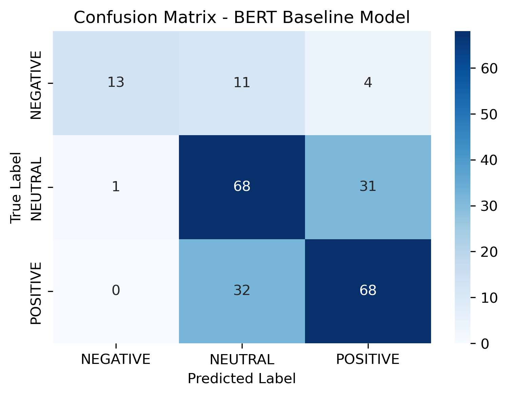
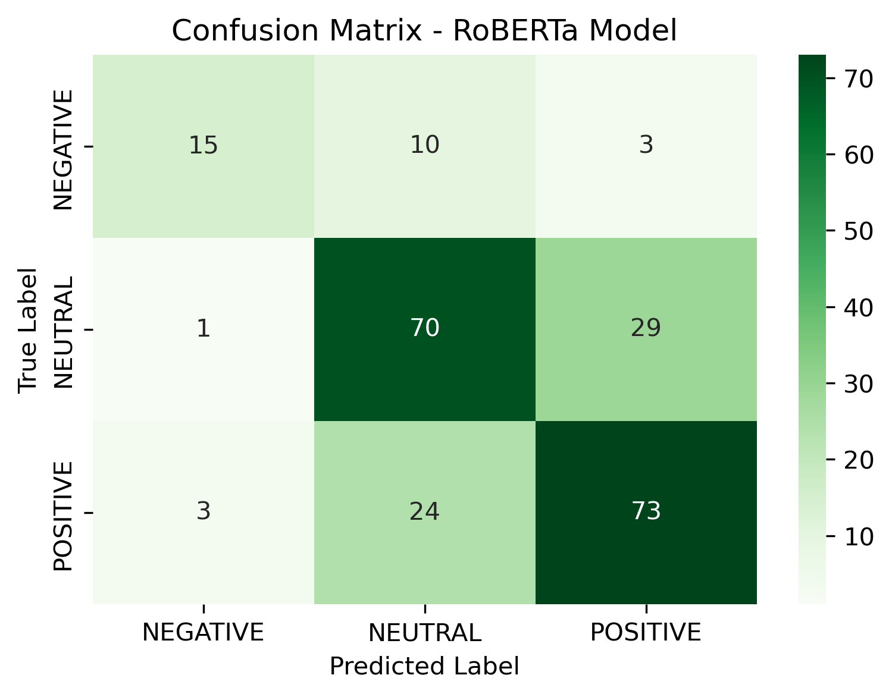

# Fine-Tuning Pre-trained Language Models for Zomato Sentiment Analysis

## 📌 Project Overview
Project ini bertujuan untuk melakukan *fine-tuning* dan perbandingan performa dua model bahasa terpra-latih (*Pre-trained Language Models*), yaitu **BERT (`bert-base-uncased`)** dan **RoBERTa (`roberta-base`)**, pada tugas klasifikasi teks **Analisis Sentimen Ulasan Restoran Zomato** (3 Kelas: Negative, Neutral, Positive).

---

## 📊 Dataset Description
- **Source:** Zomato Restaurant Reviews (Kaggle)
- **Task:** Text Classification (Sentiment Analysis)
- **Classes:** 3 Classes (`0: NEGATIVE`, `1: NEUTRAL`, `2: POSITIVE`)
- **Cleaning & Subsampling:** 
  - Text noise removal (`RATED\n`, tuple brackets, and metadata).
  - Subsampled up to 1,000 samples per class to mitigate class imbalance.
  - **Total Samples:** 2,280 reviews.
- **Data Splitting (Stratified):**
  - **Train Set (80%):** 1,824 samples
  - **Validation Set (10%):** 228 samples
  - **Test Set (10%):** 228 samples

---

## ⚙️ Experimental Setup & Hyperparameters
Fine-tuning dilakukan menggunakan PyTorch dan Hugging Face `Trainer` API di GPU Apple Silicon (MPS).

| Hyperparameter | Value | Justification |
| :--- | :--- | :--- |
| **Learning Rate** | `2e-5` | Mencegah *catastrophic forgetting* pada bobot terpra-latih transformer. |
| **Batch Size (Effective)** | `16` (`8 per device` × `2 grad accum`) | Mengoptimalkan alokasi memori VRAM GPU dan stabilitas estimasi gradien. |
| **Epochs** | `3` | Memberikan konvergensi yang cukup tanpa memicu *overfitting*. |
| **Optimizer & Regularization** | AdamW with `weight_decay = 0.01` | Mencegah overfitting melalui L2 regularization. |
| **Best Model Metric** | `Macro F1-Score` | Evaluasi yang adil untuk seluruh kelas sentimen. |

---

## 📈 Evaluation Results & Comparison

Pengujian dilakukan pada **Test Set (228 unseen samples)**:

| Model Architecture | Test Accuracy | Test F1 Macro |
| :--- | :---: | :---: |
| **BERT Baseline (`bert-base-uncased`)** | 65.35% | 64.45% |
| **RoBERTa (`roberta-base`)** | **69.30%** | **67.89%** |

### 🔍 Key Findings & Analysis
1. **RoBERTa Outperforms BERT:** Model **RoBERTa** mengungguli BERT dengan peningkatan akurasi **+3.95%** dan Macro F1-Score **+3.44%**. Hal ini disebabkan oleh strategi *dynamic masking* dan *pre-training* yang lebih besar pada RoBERTa, sehingga lebih andal dalam memahami nuansa ulasan makanan/restoran.
2. **Confusion Matrix Analysis:**
   - Kedua model dapat mengenali kelas **NEGATIVE** dengan *precision* yang sangat tinggi.
   - Kesalahan prediksi terbesar terjadi antara kelas **NEUTRAL** dan **POSITIVE**, yang disebabkan oleh kemiripan batas bahasa pada ulasan restoran (misal: *"Makanannya lumayan"* vs *"Makanannya enak"*).

---

## 📸 Confusion Matrix Visualizations

### BERT Baseline


### RoBERTa Model


---

## 🛠️ How to Run
1. Clone this repository:
   ```bash
   [git clone [https://github.com/USERNAME/REPOSITORY_NAME.git](https://github.com/USERNAME/REPOSITORY_NAME.git)
](https://github.com/NaufalApta/Final_Project_NLP.git)
